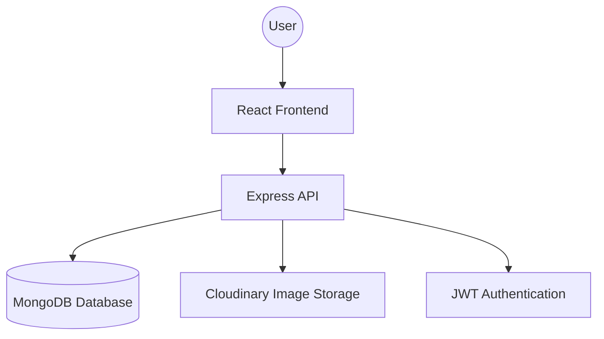

# 3. System Design

## System Architecture
Siit Coderelic follows the **MERN Stack Architecture**, which is a 3-tier architecture:
1. **Presentation Tier (Frontend)**: React.js handles the user interface and interactions.
2. **Logic Tier (Backend)**: Node.js and Express manage the business logic and API requests.
3. **Data Tier (Database)**: MongoDB stores user profiles and project data.

Additionally, **Cloudinary** is used as an external service for media storage.

## Flow of the System
1. **User Interaction**: User visits the website and interacts with the React frontend.
2. **API Request**: The frontend makes HTTP requests to the Backend (Express) using Axios.
3. **Authentication**: The Backend verifies the user via JWT (JSON Web Token) stored in the browser.
4. **Data Retrieval/Storage**: The Backend communicates with MongoDB using Mongoose (ODM).
5. **Response**: The Backend sends back JSON data to the Frontend, which then re-renders the UI.

## Data Flow Explanation
- **User Signup**: User Input -> Frontend Validator -> API Post -> Hashing -> MongoDB Save.
- **Publish Project**: Project Info + Image -> Multer Middleware -> Cloudinary Upload -> URL Saved in MongoDB.
- **Search**: Search Query -> API GET -> MongoDB Query -> Filtered Results -> Display on UI.

## High-Level Design

## Module-Wise Design
### 1. Authentication Module
Responsible for user login, registration, and session management. It ensures that only authorized users can publish or edit projects.

### 2. Project Module
The core module that handles the lifecycle of a "Project" entity – including creation, retrieval of all projects, searching, and viewing specific details.

### 3. User Profile Module
Allows users to manage their identity on the platform, including their bio, profile picture, and their collection of published projects.

### 4. Search & Filter Module
A utility module that allows users to query the database and find projects based on keywords.

## Design Patterns Used
- **MVC (Model-View-Controller)**: The backend follows this pattern where `models` define the schema, `controllers` handle the logic, and the `frontend` acts as the view.
- **Component-Based Architecture**: The frontend is built using reusable React components for consistency and maintainability.
- **RESTful API**: Standard HTTP methods (GET, POST, PUT, DELETE) are used for all data operations.
