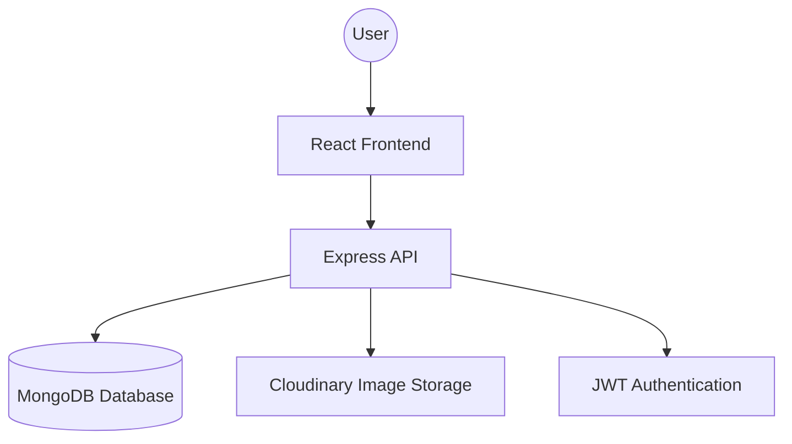

# 🎓 SIIT CODERELIC
## Final Project Documentation

**Project Title:** SIIT CODERELIC - A Comprehensive Project Showcase and Collaboration Platform
**Student Name:** [Student Name]
**Guide Name:** [Guide Name]
**Institute Name:** [Institute Name]
**University Name:** [University Name]
**Academic Year:** 2025-2026

---

# 1. Project Overview

## Project Title
**Siit Coderelic** - A Comprehensive Project Showcase and Collaboration Platform

## Problem Statement
In the current academic and professional environment, students and developers often struggle to showcase their technical projects in an organized manner. Traditional methods like sharing code via ZIP files or simple GitHub links often lack the visual context and detailed explanation needed for recruiters or peers to understand the project's complexity. There is a need for a dedicated hub where developers can publish, categorize, and document their work with rich media and structured information.

## Purpose of the Project
The purpose of **Siit Coderelic** is to provide a specialized platform for developers to host their project portfolios. It serves as a bridge between building a project and showcasing it to the world, offering a clean, user-friendly interface to manage multiple projects under a single profile.

## Objectives
- To provide a secure authentication system for users to manage their profiles.
- To enable users to upload and publish their projects with descriptions, screenshots, and links.
- To implement a searchable database of projects categorized by technology and domain.
- To create a visually appealing dashboard for users to track their contributions.
- To provide a collaborative environment where users can discover and learn from each other's work.

## Target Users
1. **Students**: To showcase their college projects.
2. **Developers**: To build a professional portfolio of their side projects.
3. **Recruiters**: To browse and evaluate the technical skills of potential candidates.
4. **Academics**: To maintain a centralized repository of student submissions.

## Real-World Use Case
Imagine a final-year CS student who has built several impressive projects but doesn't have a single place to show them all off visually. With Siit Coderelic, the student can create a profile, upload screenshots of their apps, add descriptions, and share one single "Portfolio Link" on their resume. This allows recruiters to see the actual application UI and functionality before even looking at the source code.

## Summary
Siit Coderelic is a **MERN Stack** (MongoDB, Express, React, Node.js) web application designed as a social hub for developers. It features a modern, responsive frontend built with React and Tailwind CSS, and a robust backend powered by Node.js and Express. The platform allows users to register, log in, and publish detailed project entries including images (hosted on Cloudinary), descriptions, and live links, making project discovery and sharing seamless.

---

# 2. System Analysis

## Existing System
Currently, most students and developers use a combination of different platforms to share their work:
- **Cloud Storage (Google Drive/Dropbox)**: Sharing ZIP files which are hard to preview.
- **Generic Social Media (LinkedIn/Twitter)**: Projects get lost in a feed and are not searchable by tech stack.
- **GitHub**: Highly technical and lacks a "gallery" or "portfolio" view for non-technical viewers.

## Problems in Existing System
- **Lack of Visual Representation**: Hard to see how the app looks without running it locally.
- **Poor Organization**: Projects are often scattered across folders or multiple repositories.
- **Searchability Issues**: Finding projects based on specific categories or features is difficult.
- **High Friction**: Viewers have to download and install dependencies to see the project in action.

## Proposed System
The proposed system, **Siit Coderelic**, addresses these gaps by providing:
- **Visual-First Gallery**: A beautiful grid view of project thumbnails and summaries.
- **Unified Profile**: All projects belonging to a user are grouped in one place.
- **Rich Metadata**: Each project includes tech stack, descriptions, and direct links.
- **Cloud-Based Storage**: Images are stored in the cloud for fast and reliable access.

## Benefits of the New System
- **Enhanced Visibility**: Projects are presented professionally.
- **Effortless Discovery**: Search and filter tools make it easy to find specific work.
- **Reduced Friction**: Quick previews and descriptions save time for recruiters.
- **Structured Documentation**: Encourages users to write better project summaries.

## Functional Requirements
1. **User Authentication**: Secure registration and login using JWT and Bcrypt.
2. **Project Management**: Users can create, update, and delete their project entries.
3. **Image Uploads**: Integration with Cloudinary for handling project screenshots.
4. **Search Functionality**: Search projects by title, description, or tags.
5. **Profile Management**: Users can update their personal information and bio.
6. **Detailed View**: A dedicated page for each project showing full details.

## Non-Functional Requirements
1. **Performance**: Fast page loads optimized by the Vite build tool.
2. **Scalability**: Backend designed to handle increasing numbers of users and projects.
3. **Security**: Password hashing and protected API routes.
4. **Responisveness**: Mobile-friendly design using Tailwind CSS.
5. **Usability**: Simple and intuitive UI/UX for a smooth user journey.
6. **Reliability**: Robust error handling on both frontend and backend.

---

# 3. System Design

## System Architecture
Siit Coderelic follows the **MERN Stack Architecture**, which is a 3-tier architecture:
1. **Presentation Tier (Frontend)**: React.js handles the user interface and interactions.
2. **Logic Tier (Backend)**: Node.js and Express manage the business logic and API requests.
3. **Data Tier (Database)**: MongoDB stores user profiles and project data.

Additionally, **Cloudinary** is used as an external service for media storage.

## Flow of the System
1. **User Interaction**: User visits the website and interacts with the React frontend.
2. **API Request**: The frontend makes HTTP requests to the Backend (Express) using Axios.
3. **Authentication**: The Backend verifies the user via JWT (JSON Web Token) stored in the browser.
4. **Data Retrieval/Storage**: The Backend communicates with MongoDB using Mongoose (ODM).
5. **Response**: The Backend sends back JSON data to the Frontend, which then re-renders the UI.

## Data Flow Explanation
- **User Signup**: User Input -> Frontend Validator -> API Post -> Hashing -> MongoDB Save.
- **Publish Project**: Project Info + Image -> Multer Middleware -> Cloudinary Upload -> URL Saved in MongoDB.
- **Search**: Search Query -> API GET -> MongoDB Query -> Filtered Results -> Display on UI.

## High-Level Design


## Module-Wise Design
### 1. Authentication Module
Responsible for user login, registration, and session management. It ensures that only authorized users can publish or edit projects.

### 2. Project Module
The core module that handles the lifecycle of a "Project" entity – including creation, retrieval of all projects, searching, and viewing specific details.

### 3. User Profile Module
Allows users to manage their identity on the platform, including their bio, profile picture, and their collection of published projects.

### 4. Search & Filter Module
A utility module that allows users to query the database and find projects based on keywords.

## Design Patterns Used
- **MVC (Model-View-Controller)**: The backend follows this pattern where `models` define the schema, `controllers` handle the logic, and the `frontend` acts as the view.
- **Component-Based Architecture**: The frontend is built using reusable React components for consistency and maintainability.
- **RESTful API**: Standard HTTP methods (GET, POST, PUT, DELETE) are used for all data operations.

---

# 4. Implementation Details

## Folder Structure Explanation
The project is structured into two main directories: `frontend` and `backend`.

### Root Structure
- `/backend`: Contains the Node.js/Express server and MongoDB models.
- `/frontend`: Contains the React/Vite application.
- `/documentation`: Project documentation files.

### Backend Structure Breakdown
- `/models`: Defines the blueprints for data (Project.js, User.js).
- `/routes`: Defines the API endpoints (authRoutes.js, projectRoutes.js, userRoutes.js).
- `/controllers`: Contains the logic for each API route.
- `/middleware`: Custom functions like `authMiddleware.js` for protecting routes.
- `/config`: Database connection configuration (`db.js`).
- `server.js`: The main entry point for the backend server.

### Frontend Structure Breakdown
- `/src/pages`: Individual pages of the application (Home, Login, Profile, etc.).
- `/src/components`: Reusable UI elements like the Navbar or Project Cards.
- `/src/context`: React Context for global state management (User information).
- `/src/utils`: Helper functions and API configuration.
- `App.jsx`: Main routing and layout wrapper.
- `main.jsx`: Renders the app into the DOM.

## Explanation of Major Files
1. **backend/server.js**: Sets up Express, connects to MongoDB, and registers all API routes.
2. **frontend/src/App.jsx**: Defines the routes for the application using `react-router-dom`.
3. **backend/models/Project.js**: The schema defining what a project contains (Title, Description, Image URL, Tech Stack, Owner).
4. **frontend/src/pages/PublishProject.jsx**: A complex form that handles file uploads and project submission.

## How Frontend Connects to Backend
The connection is established using the **Axios** library. 
- The backend runs on a specific port (e.g., `http://localhost:5000`).
- The frontend makes requests to this URL (e.g., `axios.post('http://localhost:5000/api/projects', data)`).
- Environment variables are used to store the API Base URL for easy switching between local and production environments.

## How Database is Connected
The project uses **Mongoose** to connect to **MongoDB Atlas** (cloud database).
- A connection string (URI) is stored in the `.env` file of the backend.
- The `config/db.js` file handles the connection logic and logs success or failure to the console.

## Step-by-Step Flow of Execution
1. **User Request**: User fills the "Publish Project" form on the React frontend.
2. **Frontend Validation**: The app checks if all required fields are filled.
3. **API Call**: `PublishProject.jsx` sends a POST request with the form data.
4. **Backend Reception**: `server.js` routes the request to `projectRoutes.js`, then to the controller.
5. **Auth Check**: `authMiddleware` verifies the user's JWT token.
6. **Processing**: The controller saves the data to MongoDB.
7. **Confirmation**: A success message is sent back to the frontend.
8. **UI Update**: The frontend redirects the user to their gallery or shows a success toast.

---

# 5. Technology Stack

## Frontend Technologies
- **React.js (v19)**: A powerful JavaScript library for building dynamic user interfaces. Chosen for its component-based architecture and widespread industry adoption.
- **Vite**: The build tool and development server. Chosen for its extreme speed and modern developer experience compared to traditional tools like Create React App.
- **Tailwind CSS**: A utility-first CSS framework. Chosen for rapid UI development and easy customization without writing complex CSS files.
- **Framer Motion**: Used for high-quality animations and smooth page transitions.
- **React Router Dom**: For handling single-page application (SPA) navigation.
- **Axios**: For making clean and efficient HTTP requests to the backend.

## Backend Technologies
- **Node.js**: A JavaScript runtime built on Chrome's V8 engine. Chosen for building scalable network applications using JavaScript.
- **Express.js**: A minimal and flexible Node.js web application framework. Chosen for its simplicity in creating RESTful APIs.
- **JWT (JSON Web Token)**: For secure user authentication. It allows the server to verify the user's identity without storing sessions on the server.
- **Bcrypt.js**: For hashing passwords before storing them in the database, ensuring high security.

## Database & Storage
- **MongoDB**: A NoSQL, document-based database. Chosen for its flexibility in handling JSON-like data, which perfectly matches the JavaScript stack.
- **Mongoose**: An ODM (Object Data Modeling) library for MongoDB and Node.js. It provides a schema-based solution to model application data.
- **Cloudinary**: A cloud-based service for managing images. Chosen to avoid storing heavy image files locally and to provide fast delivery via CDN.

## Tools & Utilities
- **VS Code**: The primary Integrated Development Environment (IDE).
- **Postman/Insomnia**: Used for testing API endpoints during development.
- **Git & GitHub**: For version control and collaborative development.
- **NPM (Node Package Manager)**: For managing project dependencies.
- **Lucide-React / React-Icons**: For professional and lightweight icons.

## Why this Tech Stack?
The **MERN Stack** (MongoDB, Express, React, Node.js) was chosen because it allows for an all-JavaScript development environment. This reduces context switching between libraries and provides a unified, efficient workflow. The addition of **Tailwind CSS** and **Vite** ensures that the application is not only functional but also highly performant and modern in its visual design.

---

# 6. Functionalities

## List of Features
1. **User Authentication**: Secure Sign-up and Sign-in functionality.
2. **Dynamic Dashboard**: A personalized profile page for users to view and manage their projects.
3. **Project Publishing**: Multi-field form for uploading project title, description, images, and links.
4. **Interactive Search**: Real-time filtering of projects based on user input.
5. **Detailed Project View**: A dedicated page for in-depth information about a specific project.
6. **Responsive Design**: Optimized for Desktop, Tablet, and Mobile screens.
7. **Social Links**: Users can link their GitHub, LinkedIn, and personal website to their profile.

## Detailed Explanation of Each Feature

### 1. User Authentication
Users can create a new account by providing their name, email, and a secure password. Once registered, they can log in to access protected features like publishing projects. The authentication state is maintained globally across the app.

### 2. Project Publishing System
This is the core feature where users can fill out a form to showcase their work.
- **Fields**: Title, Short Summary, Long Description, Tech Stack (Tags), Demo Link, GitHub Link.
- **Image Handling**: Users can upload a cover image which is instantly processed and hosted on Cloudinary.

### 3. Search & Exploration
The search page allows any visitor to find projects. As the user types, the application hits a search API that queries the MongoDB database for matching titles or descriptions.

### 4. Personal Portfolio (Profile)
The profile page acts as a mini-portfolio for the user. It displays their bio, their profile picture, and a grid of all projects they have ever uploaded.

## User Roles & Permissions
- **Guest (Unauthenticated User)**:
    - Can browse and search all projects.
    - Can view project details.
    - Cannot publish or edit projects.
- **Registered User (Authenticated)**:
    - Has all Guest permissions.
    - Can create and publish new project entries.
    - Can edit or delete their own projects.
    - Can manage their personal profile.

## User Workflow (Start to End)
1. **Discovery**: User enters the site and browses the Home page.
2. **Onboarding**: User navigates to the Register page and creates an account.
3. **Authentication**: User logs in and is redirected to their Dashboard.
4. **Action**: User clicks on "Publish Project" and fills out the technical details and uploads an image.
5. **Verification**: The project appears on the user's profile and the main search gallery.
6. **Sharing**: User copies their profile URL to share with others.

---

# 7. Command History

This document lists the essential terminal commands used during various stages of the project lifecycle.

## Project Setup & Installation

### 1. Initialize Frontend (React + Vite)
```powershell
# Navigate to project root
cd SiitCoderelic
# Create frontend with Vite
npm create vite@latest frontend -- --template react
```

### 2. Install Frontend Dependencies
```powershell
cd frontend
npm install
# Install specific libraries
npm install axios react-router-dom lucide-react framer-motion tailwindcss postcss autoprefixer
```

### 3. Initialize Backend
```powershell
cd ..
mkdir backend
cd backend
npm init -y
# Install backend dependencies
npm install express mongoose dotenv cors jsonwebtoken bcryptjs multer cloudinary multer-storage-cloudinary
```

## Running the Project Locally

### 1. Start Backend Server
```powershell
cd backend
# Run with nodemon for auto-restart on changes
npx nodemon server.js
```
*Note: `nodemon` is a tool that helps develop node.js based applications by automatically restarting the node application when file changes in the directory are detected.*

### 2. Start Frontend Development Server
```powershell
cd frontend
npm run dev
```
*This command starts the Vite development server, usually accessible at `http://localhost:5173`.*

## Building the Project for Production

### 1. Compile Frontend
```powershell
cd frontend
npm run build
```
*This command creates a `dist` folder containing optimized HTML, CSS, and JS files ready for deployment.*

## Environment Setup
Before running the commands above, ensure the following environment variables are set in a `.env` file within the `backend` folder:
```text
PORT=5000
MONGO_URI=your_mongodb_connection_string
JWT_SECRET=your_secret_key
CLOUDINARY_CLOUD_NAME=your_cloud_name
CLOUDINARY_API_KEY=your_api_key
CLOUDINARY_API_SECRET=your_api_secret
```

## Command Explanations
- **`npm install`**: Downloads and installs all the software libraries listed in `package.json`.
- **`npm run dev`**: Executes the development script defined in the frontend package.
- **`npx nodemon`**: Runs the backend server and watches for changes.
- **`npm init -y`**: Creates a default `package.json` file for a new Node.js project.
- **`npm run build`**: Optimizes the code for the best performance in a production environment.

---

# 8. Testing Documentation

## Testing Strategy
The testing strategy for Siit Coderelic focused on identifying and resolving issues at various layers of the application. Given the project's scope, a combination of **Manual Testing** and **Integration Testing** was employed to ensure a stable user experience.

## Types of Testing Used
1. **Manual Testing**: Systematically going through every feature as a user to find UI bugs and flow issues.
2. **Integration Testing**: Checking if the frontend and backend communicate correctly (e.g., verifying if a form submission actually saves data to MongoDB).
3. **Validation Testing**: Ensuring that invalid inputs (like empty emails or short passwords) are caught before being sent to the server.
4. **Responsive Testing**: Testing the application on different screen sizes (Mobile, Tablet, Desktop) using Chrome DevTools.

## Sample Test Cases

| Test Case ID | Feature | Action | Expected Output | Actual Output | Status |
|---|---|---|---|---|---|
| TC-01 | Registration | Submit form with existing email | Show error "User already exists" | Error message displayed | PASSED |
| TC-02 | Login | Submit valid credentials | Redirect to Profile page | Redirected | PASSED |
| TC-03 | Publish Project | Upload image and fill details | Project appears in gallery | Image loaded and project displayed | PASSED |
| TC-04 | Search | Type keyword in search bar | Filtered project results show up | Results updated instantly | PASSED |
| TC-05 | Security | Access /profile without login | Redirect to login page | Redirected | PASSED |

## Validation Checks
The following validation rules are implemented:
- **Email**: Must follow a valid email format (example@domain.com).
- **Password**: Minimum length of 6 characters.
- **Project Title**: Required field, cannot be empty.
- **Images**: Only specific formats (JPG, PNG, WEBP) are accepted for upload via Cloudinary.

## Bug Handling Approach
1. **Identification**: Errors logged in the browser console or server terminal.
2. **Isolation**: Determining if the bug is in the Frontend logic or Backend API.
3. **Fixing**: Modifying the code and verifying the fix locally.
4. **Re-testing**: Running the specific test case again to ensure no regressions.

## Tools Used for Testing
- **Chrome DevTools**: For inspecting the layout, monitoring network requests, and debugging JavaScript.
- **Postman**: For testing API endpoints independently of the frontend.
- **MongoDB Compass**: To verify that data is correctly stored and updated in the database.

---

# 9. GitHub Guide

## Introduction
Git is a version control system used to track changes in code, and GitHub is a platform to host those code repositories online. This guide explains how to manage the **Siit Coderelic** project using Git.

## 1. Initialize Git Repository
If you are starting from scratch in a local folder:
```bash
git init
```

## 2. Create .gitignore
A `.gitignore` file specifies which files Git should ignore. For this project, it is crucial to exclude:
- `node_modules/`: (Dependency folders are too large).
- `.env`: (Contains sensitive database and API keys).
- `dist/` or `build/`: (Compiled files are not needed in the source code).

**Example `.gitignore` content:**
```text
node_modules
.env
dist
.DS_Store
```

## 3. Version Control Workflow

### Step 1: Add Files
Choose which files you want to track:
```bash
git add .
```
*(The dot adds all changed files in the current folder)*

### Step 2: Commit Changes
Save a "snapshot" of your code with a descriptive message:
```bash
git commit -m "Initial commit: Set up MERN stack structure"
```

### Step 3: Create GitHub Repository
1. Go to [GitHub.com](https://github.com) and log in.
2. Click "New" to create a repository named `SiitCoderelic`.
3. Keep it Public or Private and click "Create repository".

### Step 4: Link Local to Online
```bash
git remote add origin https://github.com/your-username/SiitCoderelic.git
git branch -M main
git push -u origin main
```

## 4. Working with Branches
Branches allow you to work on new features without breaking the "main" code.
- **Create a branch**: `git checkout -b feature-search`
- **Switch to main**: `git checkout main`
- **Merge changes**: `git merge feature-search`

## 5. Summary of Common Commands
- **`git status`**: See which files are modified and not yet committed.
- **`git log`**: View the history of all commits.
- **`git pull`**: Download the latest code from GitHub to your local machine.
- **`git push`**: Upload your local commits to GitHub.

## Beginner Tips
- **Commit often**: Small, frequent commits are easier to manage than one giant commit.
- **Write clear messages**: Instead of "Update", use "Added user login validation".
- **NEVER push secrets**: Ensure your `.env` file is in `.gitignore` before your first push!

---

# 10. Deployment Guide

Deploying means making your website accessible to everyone on the internet. Since this is a MERN stack app, we usually deploy the Frontend and Backend separately.

## 1. Deploying Frontend (Vercel or Netlify)
Vercel and Netlify are excellent for React apps.

### Using Vercel (Recommended):
1. **Prepare**: Ensure your code is on GitHub.
2. **Login**: Go to [Vercel.com](https://vercel.com) and link your GitHub account.
3. **Import**: Click "Add New" -> "Project" and select your `SiitCoderelic` repository.
4. **Configure**:
   - Framework Preset: **Vite**
   - Root Directory: `frontend`
5. **Environment Variables**: Add `VITE_API_URL` (the link to your deployed backend).
6. **Deploy**: Click "Deploy". Vercel will give you a live URL like `siit-coderelic.vercel.app`.

## 2. Deploying Backend (Render or Railway)
Backend services need a platform that supports Node.js and a running process.

### Using Render:
1. **New Web Service**: Connect your GitHub repo on [Render.com](https://render.com).
2. **Settings**:
   - **Root Directory**: `backend`
   - **Build Command**: `npm install`
   - **Start Command**: `node server.js`
3. **Env Vars**: Crucial! Add all variables from your `.env` file (`MONGO_URI`, `JWT_SECRET`, etc.).
4. **Deploy**: Click "Create Web Service". Render will provide a backend URL like `siit-backend.onrender.com`.

## 3. Environment Variable Setup
When deploying, you MUST set the environment variables in the hosting platform's dashboard.
- **Frontend**: Needs the backend's URL to know where to send requests.
- **Backend**: Needs the database connection string and Cloudinary keys.

## 4. Troubleshooting Common Issues

### Issue: "CORS Error"
- **Cause**: The backend is blocking requests from the frontend's new URL.
- **Fix**: Update the `cors()` config in `server.js` to include your Vercel URL.

### Issue: "Blank Page after build"
- **Cause**: Typically a routing problem or missing environment variable.
- **Fix**: Check the browser console (F12) for error messages and ensure all API URLs are correct.

### Issue: "Database Connection Timeout"
- **Cause**: MongoDB Atlas might be blocking the IP of your hosting server.
- **Fix**: In MongoDB Atlas, go to "Network Access" and "Allow Access from Anywhere" (0.0.0.0/0) for testing.

## Summary Checklist
- [ ] Code is pushed to GitHub.
- [ ] Frontend is building successfully on Vercel/Netlify.
- [ ] Backend is running on Render/Railway.
- [ ] Database IP Whitelist is configured.
- [ ] Environment variables are added to both platforms.
- [ ] Frontend can successfully login/fetch data from the deployed backend.

---

# 11. User Manual

Welcome to **Siit Coderelic**! This guide will help you navigate and use the platform effectively to showcase your amazing projects.

## 1. Getting Started
To begin, visit the home page. You can browse existing projects without an account, but to upload your own, you need to sign up.

### Creating an Account
1. Click the **Register** button in the navigation bar.
2. Enter your full name, email address, and a secure password.
3. Click "Submit". You will be automatically logged in and redirected to your profile.

## 2. Managing Your Profile
Your profile is your digital business card.
- **Viewing Profile**: Click on your username or "Profile" in the navbar.
- **Editing Bio**: You can update your professional summary and social links (GitHub/LinkedIn) from the profile settings.

## 3. How to Publish a Project
1. Navigate to the **Publish** page.
2. **Project Title**: Use a clear, catchy name for your project.
3. **Summary**: A one-sentence hook (e.g., "A real-time chat app using Socket.io").
4. **Description**: Detail the features, challenges you solved, and how to use the app.
5. **Tech Stack**: Type the technologies used (e.g., React, Node, MongoDB).
6. **Upload Image**: Choose a high-quality screenshot of your application's UI.
7. **Links**: Provide the GitHub repo link and a Live Demo link if available.
8. Click **Publish**.

## 4. Searching for Projects
Want to see what others are building?
- Go to the **Search** page.
- Use the search bar to type keywords like "Python", "E-commerce", or "Machine Learning".
- The list will filter automatically. Click on any project card to see the full details.

## 5. Input/Output Examples

### Example: Publishing a Project
- **Input**:
    - Title: "Budget Tracker"
    - Tech Stack: "JavaScript, HTML, CSS"
    - Image: `my_app_screenshot.png`
- **Output**: A professional-looking project card on your profile with a link to view full details.

### Example: Error Handling
- **Scenario**: You forget to enter a password.
- **System Response**: A red alert message will appear saying "Password is required".
- **Scenario**: Uploading a file that is too large.
- **System Response**: An error message "File size too large" will be shown.

## 6. Tips for a Great Portfolio
- Use high-quality screenshots (no blurry images).
- Write detailed descriptions explaining *why* you built the project.
- Always include a GitHub link so others can see your clean code!
- Keep your social links updated so people can contact you.

---

# 12. Future Enhancements

While **Siit Coderelic** is a fully functional project showcase platform, there are several areas where it can be expanded and improved to become even more valuable for the developer community.

## 1. Limitations of the Current System
- **Single Image**: Currently, only one cover image can be uploaded per project.
- **No Social Features**: Users cannot comment on or "like" projects.
- **Manual Verification**: There is no automated check to verify if the provided GitHub link is valid.
- **Basic Search**: Search is limited to titles and descriptions, without advanced filtering by category or date.

## 2. Proposed Future Improvements

### Social Interaction
- **Comments & Feedback**: Allow users to leave constructive feedback on projects.
- **Likes/Stars**: Implement a "favoriting" system to highlight the most popular projects.
- **Follow System**: Allow users to follow their favorite developers to get notified of new uploads.

### Enhanced Media Support
- **Image Gallery**: Support for multiple screenshots and even video demos or YouTube embeds.
- **Markdown Support**: Allowing users to use Markdown for rich formatting in project descriptions.

### AI Integration Ideas
- **AI Summary Generator**: Use AI to automatically generate a professional summary based on the provided GitHub repository or detailed description.
- **Tech Stack Detector**: Automatically detect the technologies used in a project by analyzing the GitHub repo.
- **Project Recommendations**: Use a simple recommendation engine to suggest projects to users based on their interests.

## 3. Scalability Options
- **Microservices**: Moving from a monolith backend to microservices if the user base grows significantly.
- **Redis Caching**: Implementing Redis to cache frequently accessed project data and search results for faster load times.
- **S3 Storage**: Transitioning to AWS S3 for even more robust and cost-effective media storage at scale.

## 4. Security & Performance
- **Two-Factor Authentication (2FA)**: Adding an extra layer of security for user accounts.
- **Role-Based Access Control (RBAC)**: More granular permissions for different types of users (e.g., Moderators, Admins).
- **Service Workers**: Implementing PWA (Progressive Web App) features for offline access and project caching.

## 5. Conclusion on Roadmap
The roadmap for Siit Coderelic is focused on making it a more interactive and intelligent platform. By transitioning from a simple "Gallery" to a "Collaborative Hub", the platform can provide significantly more value to developers looking to grow their careers.

---

# 13. Conclusion

## Final Summary
**Siit Coderelic** has been successfully designed and implemented as a professional project showcase platform. By leveraging the power of the **MERN Stack**, the application provides a robust, scalable, and modern solution for the problem of project fragmentation among students and developers. The platform successfully bridges the gap between development and presentation, offering a visually stunning "Living Portfolio" for every user.

## Learning Outcomes
During the development of this project, several key technical and professional milestones were achieved:
- **Full-Stack Proficiency**: Gained deep experience in connecting a React frontend with a Node.js/Express backend.
- **Asynchronous Operations**: Mastered the use of `async/await` for handling API calls and database interactions.
- **Cloud Integration**: Successfully integrated external services like **Cloudinary** for scalable media management.
- **RESTful Design**: Implemented standard REST API patterns for predictable and clean communication between system components.
- **Modern UI/UX**: Utilized **Tailwind CSS** and **Framer Motion** to create an interface that is not only functional but also highly aesthetic.

## Technical Skills Gained
- **Frontend**: React Hooks, Context API, Routing, Responsive Design with Tailwind.
- **Backend**: API Route handling, JWT Authentication, Password Hashing with Bcrypt.
- **Database**: Schema design with Mongoose, CRUD operations, and MongoDB cloud management.
- **Deployment**: Knowledge of Vercel and Render deployment pipelines.

## Project Impact
This project serves as more than just a college submission; it is a practical tool that can be used by any developer to increase their visibility in the job market. By providing a clean, organized, and searchable gallery of work, it helps developers tell the story behind their code more effectively.

## Real-World Scenarios
In the real world, a platform like Siit Coderelic could be adopted by university departments to track student progress, or by developer communities to host hackathon submissions. Its modular design allows it to be easily customized for different domains, from software engineering to data science and UI/UX design.

## Final Note
The journey of building Siit Coderelic has been one of continuous learning and problem-solving. While the current version provides all the essential features for an MVP (Minimum Viable Product), the potential for future growth remains vast. This project stands as a testament to the power of modern web technologies to solve real-world organizational challenges.
